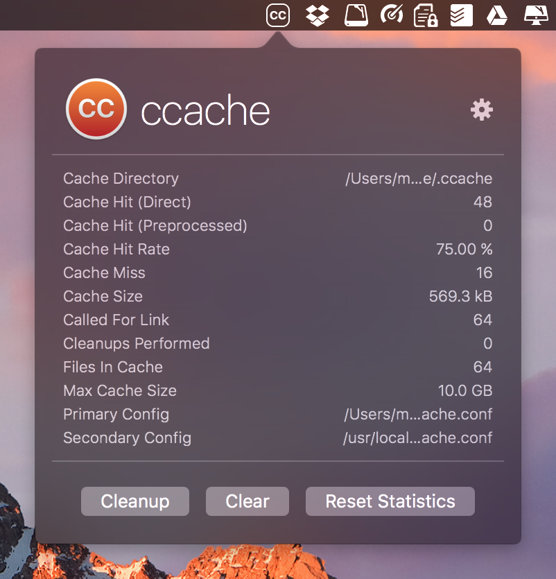
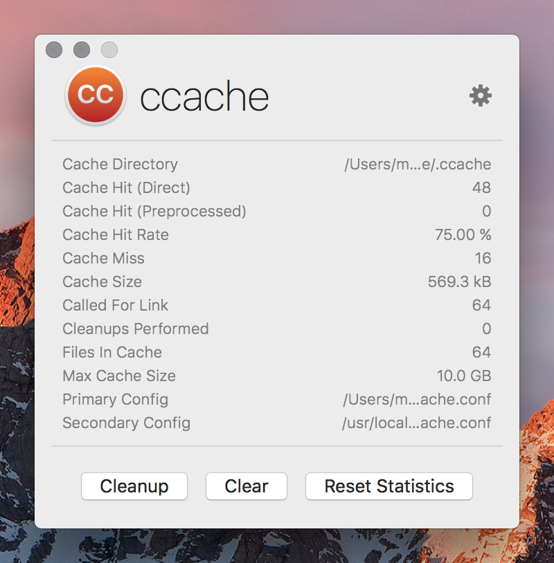

ccache-gui
==========

  

### About

GUI helper application for the **[ccache](https://ccache.samba.org)** tool.

**ccache** can be installed on macOS with **[Homebrew](https://brew.sh)**:

    brew install ccache

The application run by default in the menu bar, but the window can be detached for convenience.

License
-------

Project is released under the terms of the MIT License.

Repository Infos
----------------

    Owner:			Jean-David Gadina - XS-Labs
    Web:			www.xs-labs.com
    Blog:			www.noxeos.com
    Twitter:		@macmade
    GitHub:			github.com/macmade
    LinkedIn:		ch.linkedin.com/in/macmade/
    StackOverflow:	stackoverflow.com/users/182676/macmade
